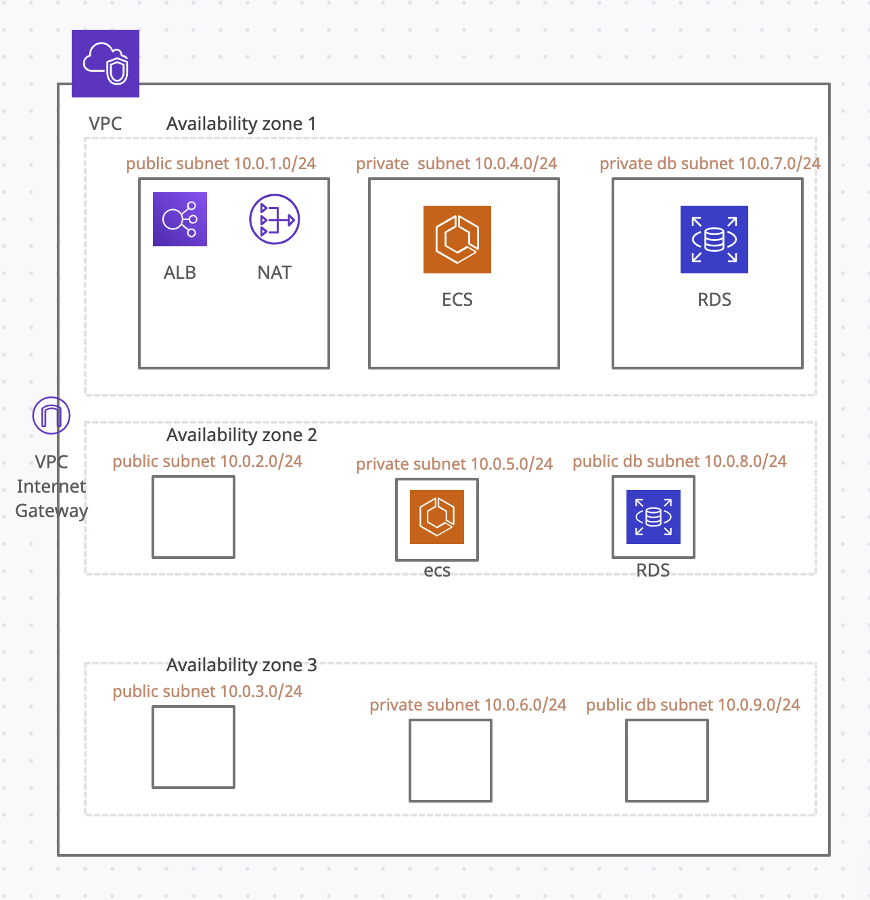
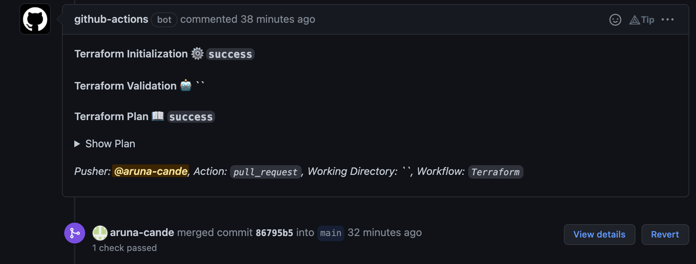

# TechChallengeApp_Infrastructure
This repository contains the terraform code necessary to run the [TechChallengeApp](https://github.com/servian/TechChallengeApp) on aws ECS(Elastic container service).

## Pre requisites 
1. Create a terraform [user](https://docs.aws.amazon.com/IAM/latest/UserGuide/id_users_create.html) with administrative rights in order to manage the infrastructure using code.
2. create a aws s3 [bucket](https://www.terraform.io/language/settings/backends/s3) in order to hold the [terraform remote state](https://www.terraform.io/language/state/remote).

## Tools Requirements
* [Download and intall terrafom](https://www.terraform.io/downloads)
* [Install the AWS CLI](https://docs.aws.amazon.com/cli/latest/userguide/getting-started-install.html).
* [Configure the AWS CLI](https://docs.aws.amazon.com/cli/latest/userguide/cli-configure-quickstart.html) using the credentials from previously created user.

## Architecture

AWS VPC(Virtual private cloud) networking diagram overview and the main resources contained in it.

## Variables
### Input
| Name  | Type | Description |
| ------------- | ------------- | ------------- |
|region|string|aws region in which resources will be deployed|
|vpc_cidr_block|list(string) |cidr block for the vpc network|
|app_subnet_cidr_blocks|list(string)|subnet cidr in which the application will be deployed|
|db_subnet_cidr_blocks|list(string)| subnet cidr in which the database instance will be created|
|public_subnet_cidr_blocks|list(string)|subnet cidr in which public resources will becreated|
|service|string|service name|
|image|string|container registry image url|
|container_cpu|string|cpu units for task|
|container_memory|string|container memory for task|
|min_capacity|string|minimum amount of tasks running|
|max_capacity|string|maximum amount of tasks running|
|command|list(string)|arguments for entrypoint|
|allocated_storage|string|allocated storage for RDS instance|
|db_instance_class|string|determines computation and memory capacity for the insatance|

Note: The command should first be set to ["updatedb", "-s"] in order to create the tables and seed with test data. After tables are created we should set command to ["serve"] and run terraform again in order to start serving the application.


## Runing terraform

### Local
1. Initialize terraform project
```bash
> terraform init -backend=true  -backend-config=environments/prod/backend.tfvars
```

2. Plan terraform project
```bash
> terraform plan -out=out.plan -var-file=environments/prod/variables.tfvars
```

3. Apply planed terraform project
```bash
> terraform apply out.plan
```

### Github action
1. Create a branch with changes to be executed by terraform.
2. Test terraform initialization and terraform planning localy to make sure everything works as expected.
3. Commit changes into github repository.
4. Create a pull request into main branch from previously commited branch.
5. [Github action workflow](.github/workflows/terraform.yml) will start execution and after finish the result will be visible in the Pull request.


